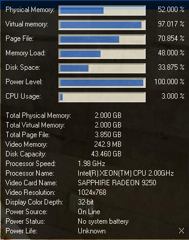



## System Monitor Crystal

### Description

View your computer performance straightforward with System Monitor Crystal. This application view the Physical RAM memory, Virtual Memory, Paging File, Memory Load, CPU Usage, Power Life , Disk Space and Disk Capacity (System partition only), Processor Name, Processor Clockspeed, Video Card Name, Video Memory, Video Resolution, Display Color Depth, and Power Source. It blinks red when there is a critical situation. It has a transparency effect to easily blend with Windows Vista or Later Windows. This is one of the most easy and comprehensive dashboard you'll ever need.
 
### More Info
 

             |
---                |---
**Submitted On**   |2011-09-22 14:29:14
**By**             |[Martin P\. Rizal](https://github.com/Planet-Source-Code/PSCIndex/blob/master/ByAuthor/martin-p-rizal.md)
**Level**          |Advanced
**User Rating**    |5.0 (15 globes from 3 users)
**Compatibility**  |VB 6\.0
**Category**       |[Complete Applications](https://github.com/Planet-Source-Code/PSCIndex/blob/master/ByCategory/complete-applications__1-27.md)
**World**          |[Visual Basic](https://github.com/Planet-Source-Code/PSCIndex/blob/master/ByWorld/visual-basic.md)
**Archive File**   |[System\_Mon22171612292011\.zip](https://github.com/Planet-Source-Code/martin-p-rizal-system-monitor-crystal__1-74231/archive/master.zip)

